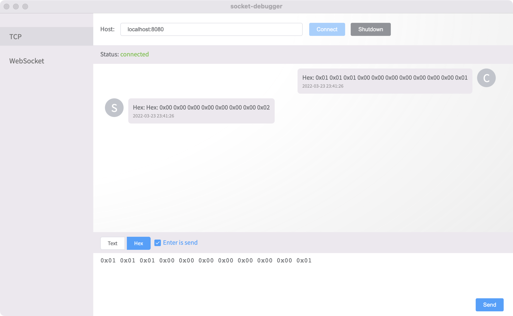
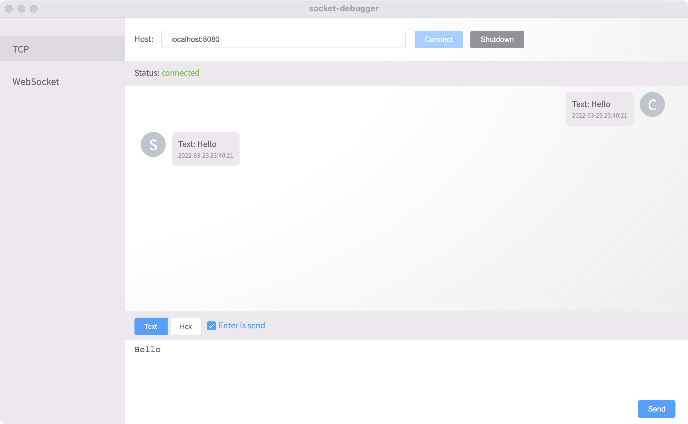
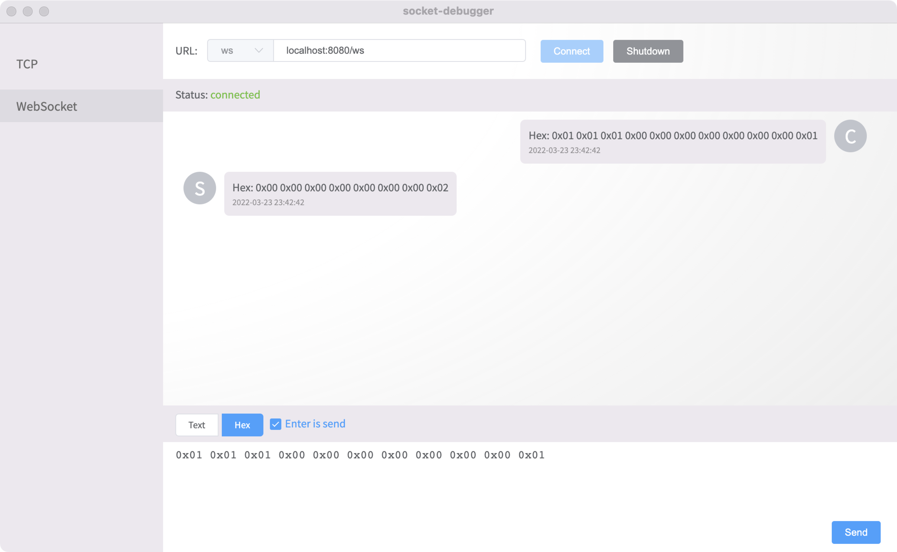
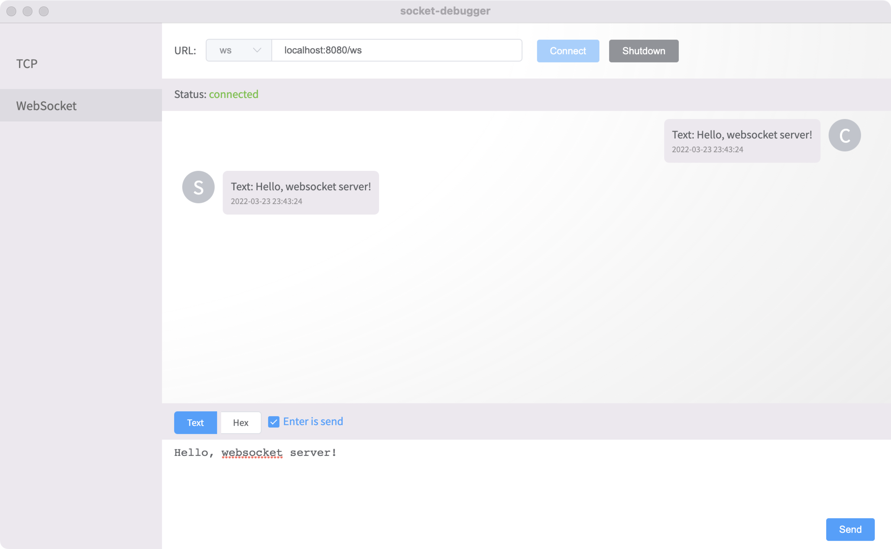

# socket-debugger

> a tool for debugging socket connection

## description

### Tcp-Hex



### Tcp-Text



### Websocket-Hex

> websocket hex data is sended by binary message. 



### Websocket-Text



## Build Setup

``` bash
# install dependencies
npm install

# serve with hot reload at localhost:9080
npm run dev

# build electron application for production
npm run build


# lint all JS/Vue component files in `src/`
npm run lint

```

---

This project was generated with [electron-vue](https://github.com/SimulatedGREG/electron-vue)@[8d4ed60](https://github.com/SimulatedGREG/electron-vue/tree/8d4ed607d65300381a8f47d97923eb07832b1a9a) using [vue-cli](https://github.com/vuejs/vue-cli). Documentation about the original structure can be found [here](https://simulatedgreg.gitbooks.io/electron-vue/content/index.html).
